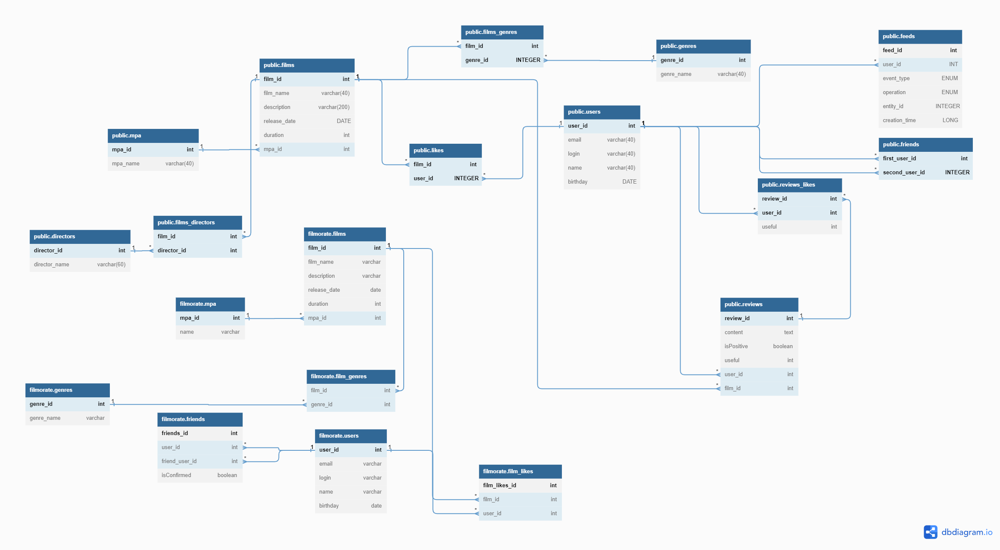

# java-filmorate
Template repository for Filmorate project.

В БД содержится несколько таблиц.
1. Таблица films хранит информацию о фильмах. 
2. Таблица films_genres хранит информацию о том каким жанрам соответствует фильм.
3. Таблица genres содержит информацию о жанрах.
4. Таблица mpa содержит информацию о возрастных рейтингах.
5. Таблица likes содержит информацию о том, какой пользователь какому фильму поставил лайк.
6. Таблица users содержит информацию о пользователях.
7. Таблица friends содержит информацию о дружбе пользователей.
8. Таблица reviews содержит информацию об отзывах
9. Таблица reviews_likes содержит информацию о лайках на отзывы
10. Таблица directors информация о режисеррах
11. Таблица films_directors информация об участии режисера в фильме

Примеры запросов в БД.

1) Запрос пользователя по идентификатору:
   SELECT
   login,
   user_name,
   birthday,
   name
   FROM users
   WHERE user_id = (иднтификатор);
2) Аналогично фильм;
3) Запросить фильмы, которые понравились пользователю
   SELECT films.name
   FROM users AS u
   INNER LEFT JOIN likes AS l ON u.user_id = l.user_id
   INNER LEFT JOIN films AS f ON l.film_id = f.film_id
   WHERE user_name = "имя пользователя";
4) Запросить жанр фильма
   SELECT g.genre
   FROM films AS f
   INNER LEFT JOIN films_genres AS g ON g.film_id = f.film_id;
